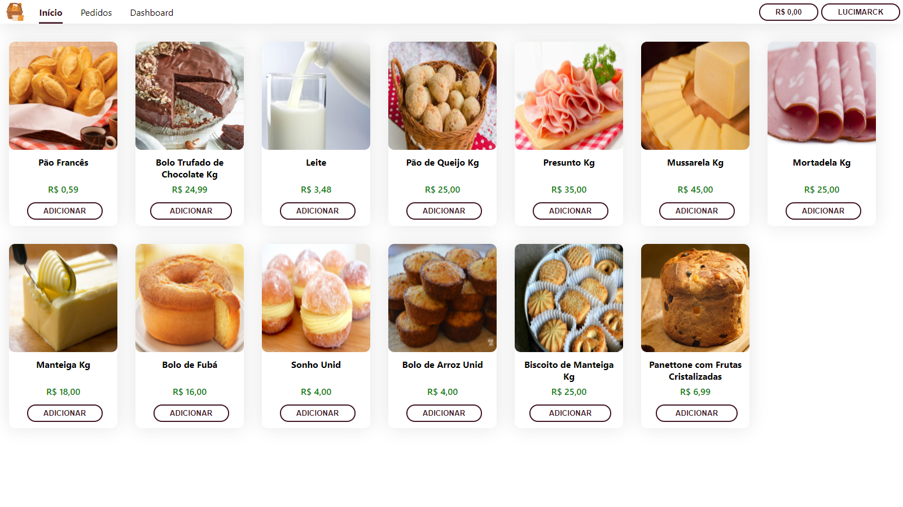

# Comercio Eletronico

Aplicação WEB desenvolvida como avaliação parcial na disciplina de Comércio Eletrônico do curso Sistemas da Informação pela Universidade Federal de Mato Grosso ministrada pelo Prof.: Dr.: Irapuan Noce Brazil.

## Ambiente

O projeto foi dividido em duas aplicações:

- Backend C# ASP.NET Core
- Frontend Typescript Next.js

E o banco de dados, por motivos de aprendizado e facilidade no trabalho cooperativo, SQLite. Contando com recursos como Json Web Tokens (JWT), OpenAPI, Swagger, SASS e entre outros.